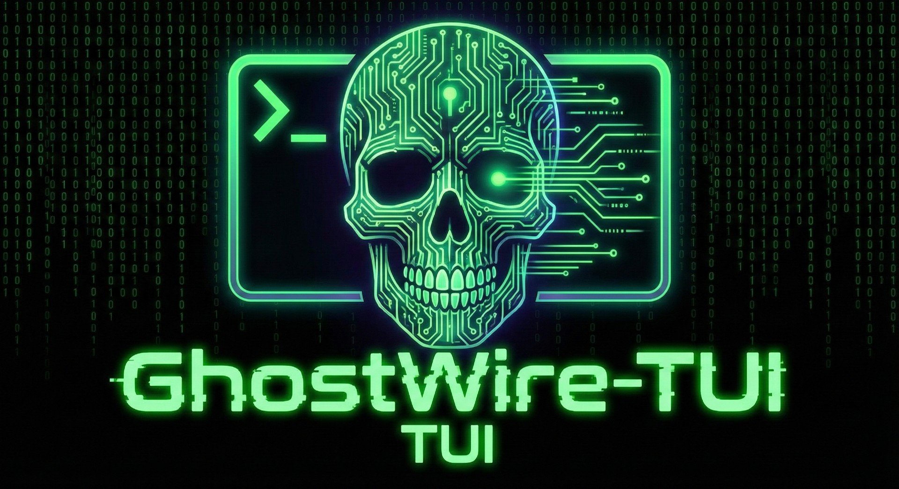

<div align="center">



[](https://ghostwire-ardt.shuttle.app)

**The server knows nothing. The terminal is everything.**

[View Demo (Coming Soon)] | [Report Bug (Coming Soon)] | [Request Feature (Coming Soon)]

</div>

---

## 📡 Transmission Incoming

**GhostWire** is a secure, ephemeral TUI chat client for those who prefer keyboards over mouse clicks. Built with **Rust** and **Ratatui**, it combines the aesthetic of a cyberpunk system monitor with the privacy of a dead-drop.

### 📸 Visual Recon

_Coming Soon_

---

## ⚡ Core Systems

| Feature                         | Description                                                                                 |
| :------------------------------ | :------------------------------------------------------------------------------------------ |
| **👻 Ephemeral Relay**          | The relay server is a "dumb broadcast." It routes traffic without storing or processing it. |
| **🛡️ Client-Side Architecture** | Designed for client-side encryption. [Coming in v0.2.0]                                     |
| **🖥️ High-Fidelity TUI**        | Built on `Ratatui`. Supports mouse capture, resizing, and custom themes.                    |
| **🚀 Blazing Fast**             | Written in Async Rust (`Tokio`). Minimal footprint, maximum throughput.                     |
| **🎨 Cyberpunk Aesthetics**     | Detailed telemetry, network activity charts, and real-time statistics.                      |

---

## 💾 Initialize Uplink (Installation)

### ⚡️ Quick Install (The "Hacker" Way)

```bash
curl -sL https://ghost.jcyrus.com/install | bash
```

### 📦 Manual Installation

### Prerequisites

- **Rust Toolchain:** 1.70+ (2021 Edition)
- **Terminal:** Support for TrueColor (NerdFonts recommended for icons)

### Compile Source

Clone the repository and build the binary:

```bash
git clone [https://github.com/jcyrus/GhostWire.git](https://github.com/jcyrus/GhostWire.git)
cd ghostwire

# Build the client only (The part you use)
cargo build --release -p ghostwire-client

# Run it
./target/release/ghostwire-client
```

---

## ☁️ Deployment (Host Your Own Relay)

Want to create a private network for your friends? Spin up the "Dumb Relay" in seconds.

### Option A: The "One-Click" (Shuttle.rs)

No config required. Perfect for free tier hosting.

```bash
cd server
cargo shuttle deploy
# Copy the URL provided (e.g., wss://ghostwire.shuttleapp.rs)
```

### Option B: Local / VPS

```bash
# For local development
cd server
cargo run --bin ghostwire-local
# Listens on 0.0.0.0:8080 by default
```

---

## 📂 Documentation

For detailed technical documentation, see the [`docs/`](docs/) directory:

- **[Client Architecture](docs/CLIENT.md)** - Async/sync split, module breakdown
- **[Server Architecture](docs/SERVER.md)** - Relay pattern, deployment
- **[Feature Details](docs/FEATURES.md)** - Implementation specifics
- **[Local Development](docs/LOCAL_DEV.md)** - Development setup

<details>
<summary><strong>🔎 Click to expand Technical Internals</strong></summary>

### The Stack

- **Client:** `Ratatui` (UI), `Tokio` (Async), `Tungstenite` (WebSockets)
- **Server:** `Axum` (Http), `Shuttle` (Infra)

### The Threading Model (Critical)

To ensure the UI never freezes at 60fps, we use a strict Actor-model separation:

1.  **Main Thread:** Synchronous. Handles drawing the UI and capturing keystrokes.
2.  **Network Task:** Asynchronous. Runs on `Tokio`. Handles the WebSocket stream.
3.  **Bridge:** `mpsc::unbounded_channel` passes messages between the two worlds.

### The Protocol (JSON)

```json
{
  "type": "MSG",
  "payload": "EncryptedBase64String...",
  "meta": {
    "sender": "User_Hash_ID",
    "timestamp": 171542100
  }
}
```

</details>

---

## 🤝 Contributing (Join the Network)

We welcome all hackers, cypherpunks, and Rustaceans.

1.  Fork the Project
2.  Create your Feature Branch (`git checkout -b feature/MatrixRain`)
3.  Commit your Changes (`git commit -m 'Add Matrix rain effect'`)
4.  Push to the Branch (`git push origin feature/MatrixRain`)
5.  Open a Pull Request

## 📄 License

Distributed under the MIT License. See `LICENSE` for more information.

---

<div align="center">
<sub>Built with 🦀 and ☕ by jCyrus</sub>
</div>
